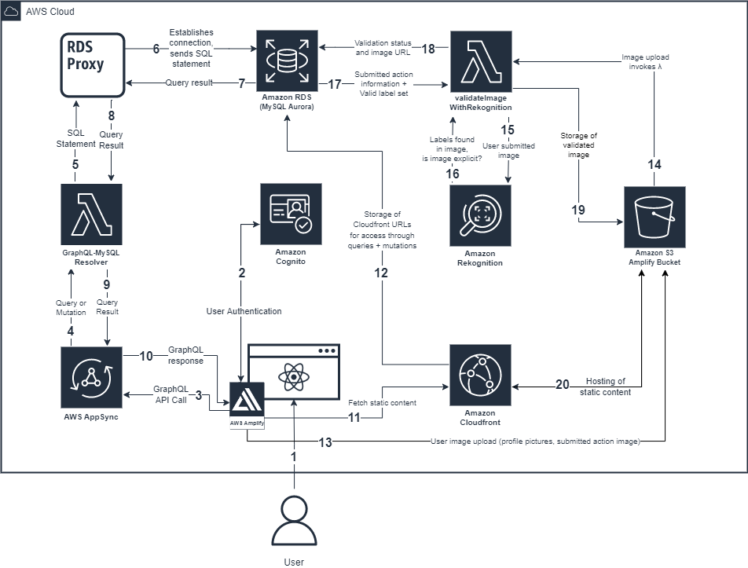

## Commit2Act

TakingITGlobal is a non-governmental organization that focuses on global issues by promoting youth engagement and awareness. In collaboration with the UBC Cloud Innovation Centre (CIC), Commit2Act is an solution that has been developed that serves as a helpful companion for youth (12-18) to drive climate-friendly decision-making in everyday life. It will guide youth towards climate-friendly lifestyle choices, measure the impact of these choices, and connect users to a community of like-minded youth who are working collaboratively towards the UN’s sustainable development goals.

| Index                                               | Description                                             |
| :-------------------------------------------------- | :------------------------------------------------------ |
| [Stack Overview](#Stack-Overview)                   | The technologies powering the project                   |
| [High Level Architecture](#High-Level-Architecture) | High level overview illustrating component interactions |
| [Deployment](#Deployment-Guide)                     | How to deploy the project                               |
| [User Guide](#User-Guide)                           | The working solution                                    |
| [Changelog](#Changelog)                             | Any changes post publish                                |
| [Credits](#Credits)                                 | Meet the team behind the solution                       |
| [License](#License)                                 | License details                                         |

# High Level Architecture

The following architecture diagram illustrates the various AWS components utliized to deliver the solution. For an in-depth explanation of the frontend and backend stacks, refer to [Architecture Deep Dive](docs/ArchitectureDeepDive.md).

# Deployment Guide

To deploy this solution, please follow our [Deployment Guide](docs/DeploymentGuide.md)

# User Guide

For instructions on how to use the web app interface, refer to [Web App User Guide](docs/UserGuide.md).

# Changelog

To view the changelog, please view [Changelog](/CHANGELOG.md)

# Credits

This application was architected and developed by Christy Lam and Michael Woolsey, with guidance from the UBC CIC technical and project management teams.

# License

This project is distributed under the [MIT License](LICENSE).
