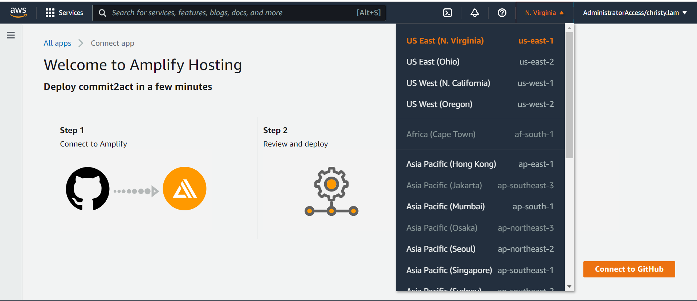

# Requirements

Before you deploy, you must have the following in place:

- [AWS Account](https://aws.amazon.com/account/)
- [GitHub Account](https://github.com/)
- [AWS CLI](https://aws.amazon.com/cli/)
- [AWS SAM](https://docs.aws.amazon.com/serverless-application-model/latest/developerguide/serverless-sam-cli-install.html)

# Step 1: Clone The Repository

First, clone the github repository onto your machine. To do this:

1. Create a folder on your desktop to contain the code.
2. Open terminal (or command prompt if on windows) and **cd** into the above folder.
3. Clone the github repository by entering the following:

```bash
git clone https://github.com/UBC-CIC/commit2act.git
```

The code should now be in the above folder. Now navigate into the commit2act folder containing amplify by running the following commands:

```bash
cd commit2act
cd commit2act
```

# Step 2: Frontend Deployment

Before installing Amplify we need to create the IAM Role that associate the policies need to implement this solution.
Navigate to the cloned directory, execute the follow CloudFormation template:

```bash
aws cloudformation deploy --template-file cfn-amplifyRole.yaml --stack-name amplifyconsole-commit2act-backend-role --capabilities CAPABILITY_NAMED_IAM
```

If you have multiple AWS Profiles, specify one with sufficient admin permissions by appending this to the command, replacing the profile name

```bash
--profile [PROFILE NAME]
```

The previous command creates the role name **amplifyconsole-commit2act-backend-role** that will be used on the next step.

The **Deploy to Amplify Console** button will take you to your AWS console to deploy the front-end solution.

<a href="https://console.aws.amazon.com/amplify/home#/deploy?repo=https://github.com/UBC-CIC/commit2act">
    
</a>

1. On the AWS console. select your region on the top right, then connect to github
2. Select the **amplifyconsole-commit2act-backend-role** for deployment
3. The deployment will take a few minutes. Wait until the status shows **Verify** in green
4. Click on left taskbar to open menu, click on Rewrites and redirects, and click on edit
5. Click and replace the first rule's source address (or add a rule if there is none) to `</^((?!\.(css|gif|ico|jpg|js|png|txt|svg|woff|ttf)$).)*$/>`, click and replace target address to `/index.html`, and select and replace **type** with `200 (Rewrite)`, then save. Add a second rule, with the source address as `</^((?!\.(css|gif|ico|jpg|js|png|txt|svg|woff|ttf)$).)*$/>`, the target address as `/index.html`, and the **type** with `404 (Rewrite)`
   Refer to [AWS's Page on Single Page Apps](https://docs.aws.amazon.com/amplify/latest/userguide/redirects.html#redirects-for-single-page-web-apps-spa) for further information on why we did that

Congratulations, your web app is now deployed!
