# Requirements

Before you deploy, you must have the following installed on your device:

- [AWS Account](https://aws.amazon.com/account/)
- [GitHub Account](https://github.com/)
- [AWS CLI](https://aws.amazon.com/cli/)
- [AWS SAM](https://docs.aws.amazon.com/serverless-application-model/latest/developerguide/serverless-sam-cli-install.html)
- [MySQL Shell](https://dev.mysql.com/downloads/shell/) (or `sudo apt install mysql-client-core-8.0` on Linux/WSL)

If you are on a Windows device, it is recommended to install the [Windows Subsystem For Linux](https://docs.microsoft.com/en-us/windows/wsl/install), which lets you run a Linux terminal on your Windows computer natively. Some of the steps will require its use. [Windows Terminal](https://apps.microsoft.com/store/detail/windows-terminal/9N0DX20HK701) is also recommended for using WSL.

# Step 1: Clone The Repository

First, clone the GitHub repository onto your machine. To do this:

1. Create a folder on your computer to contain the project code.
2. For an Apple computer, open Terminal. If on a Windows machine, open Command Prompt or Windows Terminal. Enter into the folder you made using the command `cd path/to/folder`. To find the path to a folder on a Mac, right click on the folder and press `Get Info`, then select the whole text found under `Where:` and copy with ⌘C. On Windows (not WSL), enter into the folder on File Explorer and click on the path box (located to the left of the search bar), then copy the whole text that shows up.
3. Clone the github repository by entering the following:

```bash
git clone https://github.com/UBC-CIC/commit2act.git
```

The code should now be in the folder you created. Navigate into the frontend folder containing the Amplify project by running the command:

```bash
cd commit2act
```

# Step 2: Frontend Deployment

Before installing Amplify we need to create the IAM Role that gives us the permissions needed to implement this solution. Run the following line of code:

```bash
aws cloudformation deploy --template-file cfn-amplifyRole.yaml --stack-name amplifyconsole-commit2act-backend-role --capabilities CAPABILITY_NAMED_IAM
```

If you have multiple AWS Profiles, specify one with sufficient admin permissions by appending the following text to the end of the command, replacing the profile name with the profile you would like to use for the solution (If you do this, be sure to include the same `--profile` argument for the rest of the commands starting with `aws`. The profile you are using for this project should have administrator privliges).

```bash
--profile [PROFILE NAME]
```

This step creates the IAM role called **amplifyconsole-commit2act-backend-role** that will be used on the next step.

The **Deploy to Amplify Console** button will take you to your AWS console to deploy the front-end solution.

<a href="https://console.aws.amazon.com/amplify/home#/deploy?repo=https://github.com/UBC-CIC/commit2act">
    
</a>

1. On the AWS console. select your region on the top right, then connect to GitHub. The region you deploy to has to be one of the following, or the process will fail: [us-east-1, us-east-2, us-west-1, us-west-2, ap-south-1, ap-northeast-1, ap-northeast-2, ap-southeast-1, ap-southeast-2, eu-central-1, eu-west-1, eu-west-2]
2. Select the **amplifyconsole-commit2act-backend-role** we made previously for the deployment role, and then press the orange button at the bottom of the page, and then press `Continue` when that pops up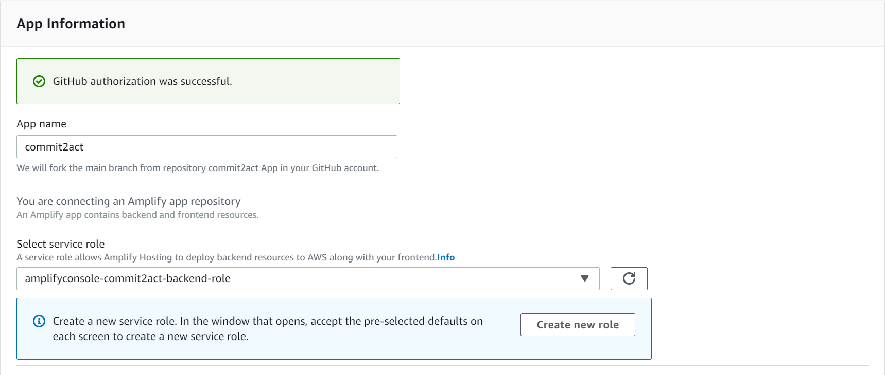
3. The deployment will take a few minutes. Wait until the status shows **Verify** in green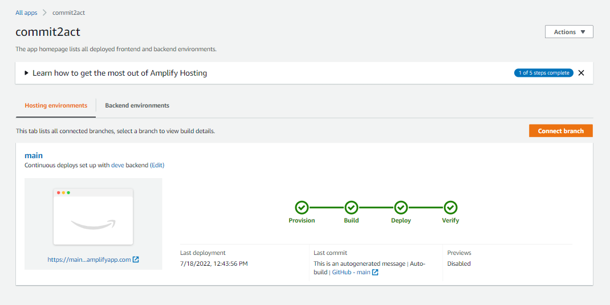
4. Click on left taskbar to open menu, click on Rewrites and redirects, and click on edit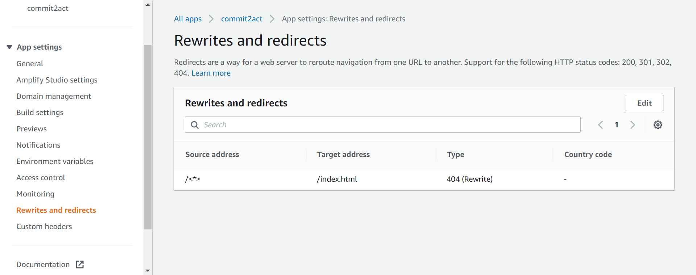
5. Click and replace the first rule's source address (or add a rule if there is none) to `</^((?!\.(css|gif|ico|jpg|js|png|txt|svg|woff|ttf)$).)*$/>`, click and replace target address to `/index.html`, and select and replace **type** with `200 (Rewrite)`, then save. Add a second rule, with the source address as `</^((?!\.(css|gif|ico|jpg|js|png|txt|svg|woff|ttf)$).)*$/>`, the target address as `/index.html`, and the **type** with `404 (Rewrite)`.
   Refer to [AWS's Page on Single Page Apps](https://docs.aws.amazon.com/amplify/latest/userguide/redirects.html#redirects-for-single-page-web-apps-spa) for further information on why we did that
   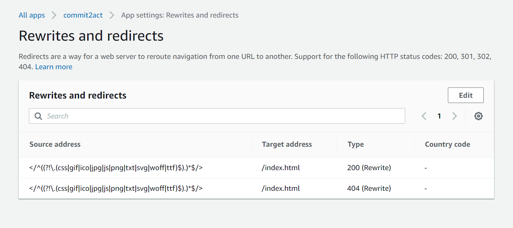


The frontend is almost finished being set up, but first we need to deploy our backend.

# Step 3: Backend Deployment

It's time to set up everything that goes on behind the scenes! For more information on how the backend works, feel free to refer to the Architecture Deep Dive, but an understanding of the backend is not necessary for deployment.

The first step is to get into the backend folder. This can be done with the following command:

```bash
cd backend
```

From here, we are going to run the CloudFormation template. This template will automatically provision the backend resources in your AWS account.

NOTE: We will need some information from the Amplify project for some of the inputs for the CloudFormation template, so make sure to have the Amplify project window open before running this command.

```bash
sam deploy --guided --capabilities CAPABILITY_NAMED_IAM --stack-name <stack-name-of-your-choosing> (--profile <AWS PROFILE>)
```

After running this, you will be prompted with a series of settings to fill in.

NOTE: when there is text in `[square brackets]`, that means whatever is inside is the default value. If you are satisfied with that value for the input, you can just press enter. If 

If at any point you make a typo, you can press CTRL+C to cancel the process, and then you can re-run the command

The following block of text is what will appear when running the command. It is a series of inputs to enter into the template, which will go line by line. Any text in `[square brackets]` is part of what will appear on screen, and these are the default values. If you are satisfied with that value for the input, you can just press enter. If there is no text in the brackets, that means it is required you enter something yourself as the input. Text in `<angled brackets>` has been added by me to help explain what to input. If there are no angled brackets, that means it is recommended just to use the default value provided, however they can be modified if wanted. Any text in `(rounded brackets)` will appear below a certain input. This will tell any important information to know about the input that is above. Spacing has been added for clarity.

```
Configuring SAM deploy
======================
   Looking for config file [samconfig.toml] :  Not found
      (this will appear on first invokation, this file can be added to later to save the inputs we used so we do not have to re-enter them on subsequent deployments)

   Setting default arguments for 'sam deploy'
   =========================================
   Stack Name [c2a]: 
      (This will be the name of the stack you entered when running sam deploy, just press enter)
   AWS Region [ca-central-1]: <REGION YOU WANT TO DEPLOY TO>
      (Ensure that you enter the same exact region you used to deploy Amplify in)
   Parameter ProjectName [commit2act]:
      (This can be anything you want)
   Parameter EnvironmentName [dev]:
      (This is just to differentiate between different builds, e.x. you can have dev, prod, and test environemnts)
   Parameter AmplifyBucket []: <WILL LOOK LIKE projectname-storage-1234567890abcd-env>
      (See instructions below titled 'Get the Amplify Bucket' to find out how to get this value)
   Parameter AppSyncApiId []: <WILL LOOK LIKE 4bCdEfGhIjKlMn0pQrStUvWxYz>
      (See instructions below titled 'Get the AppSync API ID' to find out how to get this value)
   Parameter DBName [sys]:
      (Name of the database, sys is the standard name, must begin with a letter and contain only alphanumeric characters, and be 16 characters or less)
   Parameter DBUser [admin]:
      (Name of the username to log into the database with, must begin with a letter and contain only alphanumeric characters, and be 16 characters or less)
   Parameter DBPassword []: <YOUR DB PASSWORD>
      (Password to use for the database, must contain only alphanumeric characters, and be 40 characters or less)
   Parameter DBInstanceClass [db.t4g.large]:
      (What size of database to use. This value can be changed later in RDS settings, however there will be some downtime associated with it. For more information visit https://docs.aws.amazon.com/AmazonRDS/latest/UserGuide/Concepts.DBInstanceClass.html. The allowed values are db.t2.small, db.t2.medium, db.t3.small, db.t3.medium, db.t4g.medium, db.t4g.large, db.r4.large, db.r4.xlarge, db.r4.2xlarge, db.r4.4xlarge, db.r4.8xlarge, db.r4.16xlarge, db.r5.large, db.r5.xlarge, db.r5.2xlarge, db.r5.4xlarge, db.r5.8xlarge, db.r5.12xlarge, db.r5.16xlarge, db.r6g.large, db.r6g.xlarge, db.r6g.2xlarge, db.r6g.4xlarge, db.r6g.8xlarge, db.r6g.12xlarge, db.r6g.16xlarge)
   Parameter DBEngineVersion [5.7.mysql_aurora.2.09.2]:
      (What version of MySQL Aurora to use, the default value is recommended, but any of the following allowed values should work: 5.7.mysql_aurora.2.07.0, 5.7.mysql_aurora.2.07.1, 5.7.mysql_aurora.2.07.1, 5.7.mysql_aurora.2.07.2, 5.7.mysql_aurora.2.07.3, 5.7.mysql_aurora.2.07.4, 5.7.mysql_aurora.2.07.5, 5.7.mysql_aurora.2.07.6, 5.7.mysql_aurora.2.07.7, 5.7.mysql_aurora.2.08.0, 5.7.mysql_aurora.2.08.1, 5.7.mysql_aurora.2.08.2, 5.7.mysql_aurora.2.08.3, 5.7.mysql_aurora.2.08.4, 5.7.mysql_aurora.2.09.0, 5.7.mysql_aurora.2.09.1, 5.7.mysql_aurora.2.09.2, 5.7.mysql_aurora.2.09.3, 5.7.mysql_aurora.2.10.0, 5.7.mysql_aurora.2.10.1, 5.7.mysql_aurora.2.10.2,  8.0.mysql_aurora.3.01.0, 8.0.mysql_aurora.3.01.1, 8.0.mysql_aurora.3.02.0)
   Parameter DeletionProtection [True]:
      (When deletion proteciton is enabled, when you request the deletion of a database instance in the AWS Console you are blocked and may not continue without first modifying the instance and disabling deletion protection (recommended for production))
   Parameter EncryptDatabase [True]:
      (Encrypts the database for added security)
   Parameter CloudFrontPriceClass [PriceClass_100]:
      (The price class for the CloudFront Distriution, more info on which may be best for you can be found at https://docs.aws.amazon.com/AmazonCloudFront/latest/DeveloperGuide/PriceClass.html, however the default value will work perfectly fine for North American deployments. Allowed values: PriceClass_100, PriceClass_200, PriceClass_All)
   Parameter MinConfidenceThreshold [70]:
      (The minimum percent confidence required to accept a label during image validation with Rekognition, from our testing 70 is the best to use, but it can be modified)

   #Shows you resources changes to be deployed and require a 'Y' to initiate deploy
   Confirm changes before deploy [y/N]: y
      (This is good to turn on just to ensure everything is ready to be deployed)
   #SAM needs permission to be able to create roles to connect to the resources in your template
   Allow SAM CLI IAM role creation [Y/n]:
      (Here you can just press enter, the capital Y means that just pressing enter counts as a yes)
   #Preserves the state of previously provisioned resources when an operation fails
   Disable rollback [y/N]:
      (Here you can just press enter, the capital N means that just pressing enter counts as a no)
   Save arguments to configuration file [Y/n]:
      (This will allow any future deployments of this stack to use the inputs you just entered, saving some time)
   SAM configuration file [samconfig.toml]:
      (This file will be made for you, just press enter)
   SAM configuration environment [default]:
      (You can have multiple different environments, each having different saved inputs, but for now just press enter since we do not need to worry about that for this deployment)
```

Be sure to not close the window after this process has completed, as the Outputs section produced will be imortant for the next step.

## Get the Amplify Bucket

To get the name of the Amplify Bucket, navigate to the Amplify project on the AWS website by searching for Amplify in the top search bar. Next, click on the projcet, then go to the `Backend Environments` tab. Under the environment, there will be a section called `Categories added`, and underneath it there will be a link called `File Storage`, which you should click on.

There will be the name of the bucket near the top of the page, (it should look something like projectname-storage-123456789abcde-env). 

Copy the whole name, and then paste it into your Terminal where you are running the CloudFormation template for the parameter AmplifyBucket.

## Get the AppSync API ID

To get the Cognito User Pool ID, it is a very similar process to the Amplify Bucket. Under `Categories added`, there will be a link called `API`. On the API page click the `View in AppSync` button. Then, go to the settings page, which is located on the left side of the screen. On that page, there will be the API ID. Copy the entire string, and then paste it into your Terminal where you are running the CloudFormation template for the parameter AppSyncApiId.

# Step 4: Set up Lambda Trigger

In order for the project to work as intended, we need to set up a trigger for our image validation Lambda function that will let it be called whenever an image file is uploaded to our Amplify S3 Bucket. There are two ways to do this. If you are on an Apple Computer, Linux, or using the Windows Subsystem for Linux (ensuring that you have the AWS CLI set up on these systems), you can run a script to set this up. If you are on a standard Windows machine, you must follow a manual process.


If on a Mac, Linux, or WSL instance (making sure you are in the backend directory), run the following command:
```bash
./scripts/lambda_trigger.sh <AmplifyBucketName> <ValidationFunctionARN>
```

This will set up the Lambda trigger. The two required parameters will have been outputted from the previous CloudFormation step, but if that window was closed the outputs can be found on the AWS Console by searching for `CloudFormation`, clicking on the stack you just deployed, then navigating to the `Outputs` tab (making sure you are in the same region that you deployed to). The command should look something like:
```bash
./scripts/lambda_trigger.sh projectname-storage-0123456789abcd-develop arn:aws:lambda:us-east-1:012345678901:function:validateImageWithRekognition
```

Running this will set up the trigger, and you can move on to the next step.

If you are on a Windows machine, or for whatever reason you encounter errors with the script, the trigger can be added with relative ease through the AWS Console.

Navigate to the validateImageWithRekognition Lambda on the AWS Console (search for Lambda in the box, then click on the function name). From here, click on the tab labelled `Configuration`, then go into the section called `Triggers`, then click `Add trigger`. For the source, scroll until you find `S3`. From there, in the bucket field, select the Amplify Bucket (the bucket name can be found as an output from the CloudFormation stack). Event type will be `All object create events`, prefix is `public/validation/input/`, and don't enter anything for suffix. Be sure to click the acknowledgement checkbox, then press `Add`, and the trigger is set up!

# Step 5: Set up Bucket Policy

For our app to properly load images, we have to add permissions to the Amplify S3 bucket to give CloudFront access to display our images. We can do this through a script, similar to above. Run the following:

```bash
./scripts/update_bucket_policy.sh <AmplifyBucketName> <CloudFrontOriginAccessIdentity>
```

Where AmplifyBucketName is the same as in the previous script, and CloudFrontOriginAccessIdentity can be found as a CloudFormation output.

# Step 6: Wrap up Frontend Deployment

We need to add one more thing to our Amplify project before we are all done with deploying. 

1. Copy the CloudFormation output called CloudFrontDistributionDomainName

2. On the [AWS console](https://console.aws.amazon.com/console/home), Navigate back to the amplify console by entering **Amplify**. Under the App Settings heading on the left hand sidebar, click `Environment Variables`. Click on `Manage variables`, and create an environment variable with the Variable field as `REACT_APP_CLOUDFRONT_DOMAIN_NAME`, and the Value as the Distribution Domain Name that was copied in the previous step.

Congratulations, your web app is now deployed! You can find the website URL on the main screen of Amplify under `Hosting environments`, and then clicking on the  web-browser-esque image under `main`.


# Step 7: Register Admin Account

Here, you'll learn how to register for an account on the web app, and how to set any user account to be an administrator for the app.

1. At the login page for the Commit2Act website, click create an account \
   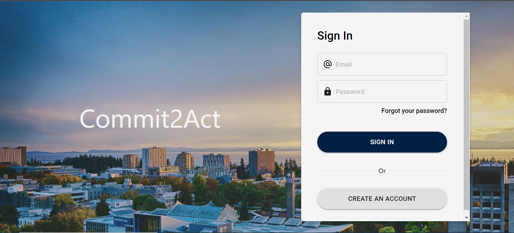
2. Enter Account Details and click Sign-up. A verification code will be sent to the email provided within the next minute \
   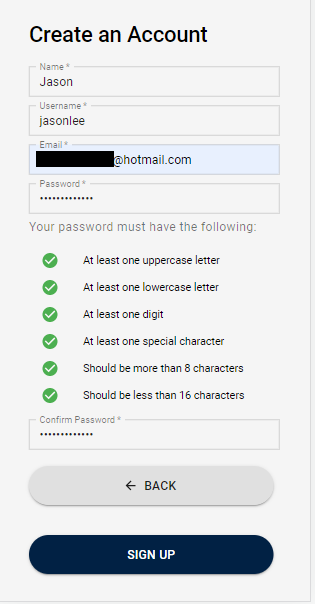
3. Retrieve the verification code from the email and enters it to Verify Account\
   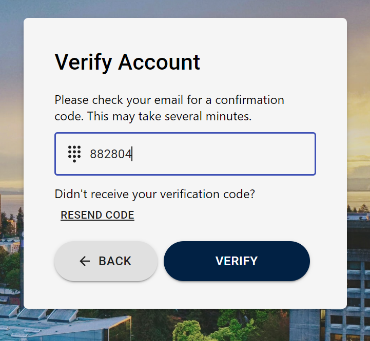
4. At the [AWS online console](https://console.aws.amazon.com/console/home), enter `Cognito` in the search bar \
   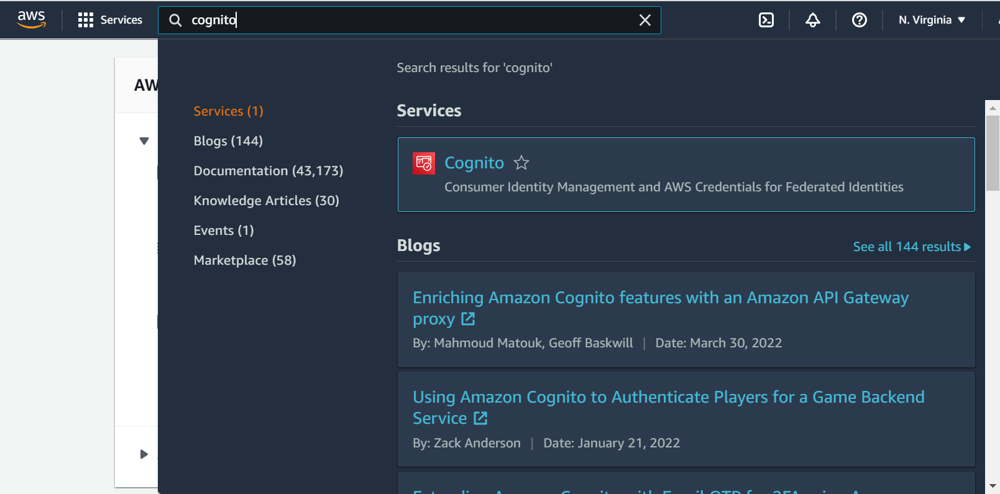
5. Select `Manage User Pools` (or click `User pools` on the left of the screen), then select the user pool corresponding to the project name (ex. `commit2act-env`) \
   
6. Click the `Users and Groups` tab on the menu on the left of the screen (if you are on the newer version of the Cognito Console you can scroll down to see the users), then select the user which you want to set to Admin \
   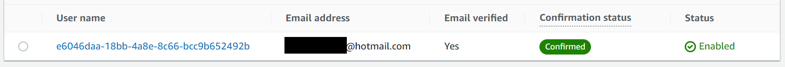
7. Scroll down to User Attributes, and click `Edit` \
   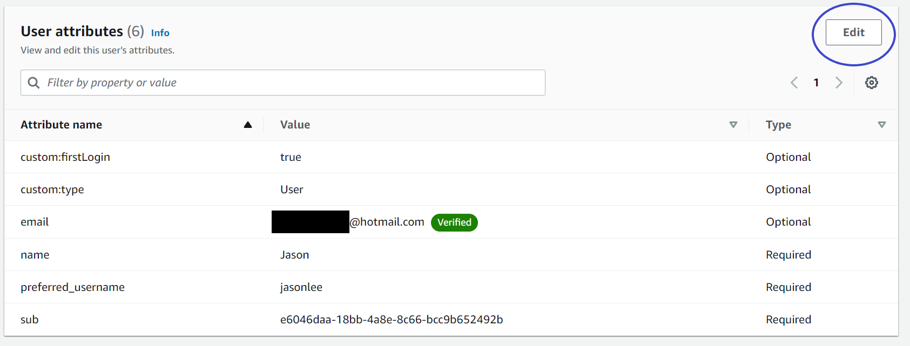
8. Scroll down to Option Attributes, and change the value in the `custom:type` field from _User_ to _Admin_. Click `Save Changes`\
   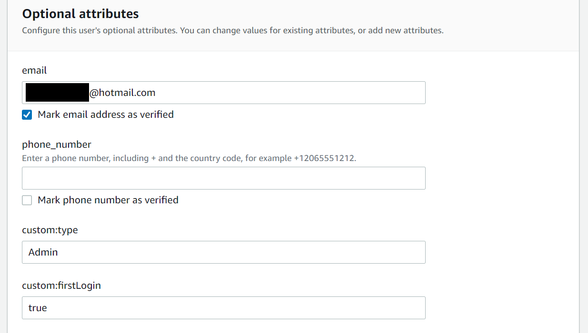
9. You have set up login credentials. Return to Commit2Act web app, and login. Your user is now an admin! (If you are having issues, try relogging on the Commit2Act web app)

# Troubleshooting

### Error #1

If you encounter the following error:

```bash
The config profile could not be found
```

Then chances are that the AWS CLI has not been correctly configured. Ensure you have correctly done so by following the [AWS CLI setup guide](https://aws.amazon.com/cli/), as indicated in the requirements section.
