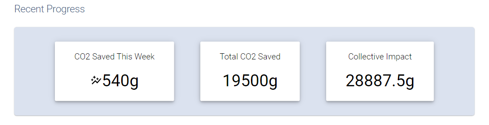
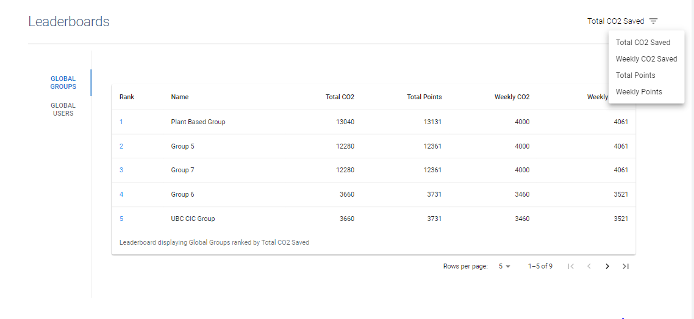
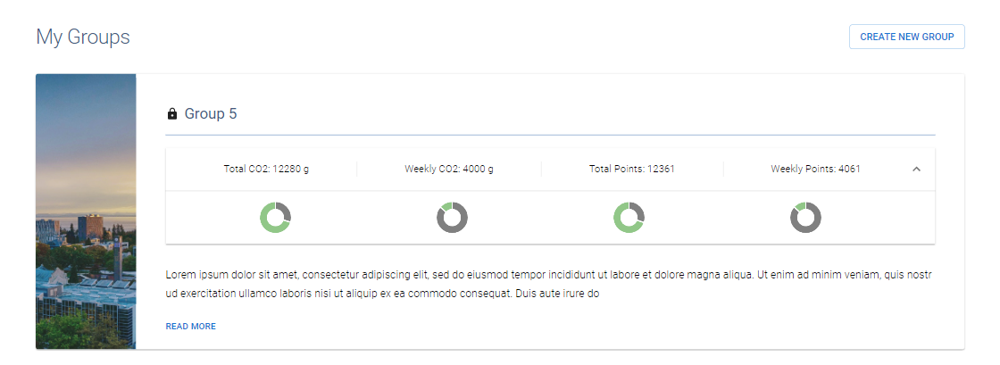
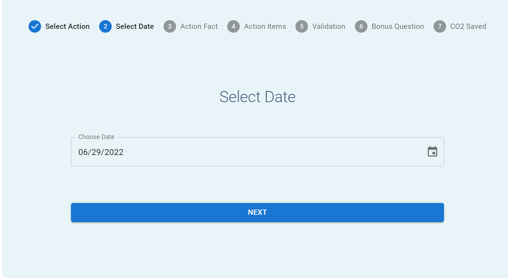

# User Guide

**Before Continuing with this User Guide, please make sure you have deployed the frontend and backend stacks.**

- [Deployment Guides](./DeploymentGuide.md)

| Index                                 | Description                                                                           |
| :------------------------------------ | :------------------------------------------------------------------------------------ |
| [Landing Page](#Landing-Page)         | Features on the Landing Page                                                          |
| [Find Group](#Find-Group)             | Searching for public groups                                                           |
| [Create New Group](#Create-New-Group) | How to create groups                                                                  |
| [Group Profile](#Group-Profile)       | Features on the Group Profile Page                                                    |
| [Log Action](#Log-Action)             | How to log an action                                                                  |
| [Validate Actions](#Validate-Actions) | How Group owners and Admin can manually validate actions that have failed rekognition |
| [Admin Dashboard](#Admin-Dashboard)   | How Admin can manage actions and quiz questions                                       |
| [Account Settings](#Account-Settings) | Managing user account information                                                     |

## Landing Page

The landing page contains 4 main sections.

### 1. Alerts

- New Actions in Need of Validation alert is displayed when the user is an admin or a group owner and there are actions by they need to validate.
- Actions Pending Validation is displayed if the user has any actions pending manual validation. This alert shows the potential impact of the user's pending actions.
  

### 2. Recent Progress

- Displays collective CO2 impact of all users on the app, and the current user's weekly and cumulative CO2 Saved
  

### 3. Leaderboards

- 2 views: Global Groups and Global Users
- Users can filter the metric they want to view by clicking the filter button (available metrics are Total CO2, Weekly CO2, Total Points and Weekly Points)
  

### 4. My Groups

- Displays card view of all groups the user belongs to
- Clicking on the group name will redirect to the group's profile page
- Clicking on the dropdown accordion opens up charts displaying the user's individual contribution for each group stat (hover over each colour in the graph to see labels - grey is the contribution of all other members, green is the user's contribution)
- Users can also access the Create Group page by clicking the Create Group button
  

## Find Group

- Searches through all public groups and displays group card for matching groups
- Users can join the group by clicking the Join Group button
  

## Create New Group

- A form for users to create a new group (an example use case would be a teacher creating a group for their class)
- Required fields are Group Name and Group Privacy (private groups require a password for users to join the group, and will not be discoverable through the Find Group searchbar)
- Successful creation of a group will redirect the user to the newly created group profile page

## Group Profile

## Log Action

The log action flow has 7 steps

### 1. Select Action

- Select an action to log from any of the icons displayed
  

### 2. Select Date

- Click on the calendar icon to display full calendar view
  

### 3. Action Fact

- A related fact to the action will be shown here. If a user has seen all possible facts, the action's fallback text will be displayed. If there is no fallback text set for the action, there will be a default message displayed.
  

### 4. Action Items

- Users must enter inputs for one or more of the action items for the selected action
  

### 5. Validation

- Users can upload an image relating to their action by dragging and dropping the image (browser view only) or by pressing the Browse button
- This image will undergo Rekognition validation to determine if it contains any of the relevant image validation labels
  

### 6. Bonus Question

- A question related to the action fact shown in step 4. The user can choose to skip the question, or answer. If the user answers the question correctly on the first try, they receive 10 bonus points. Otherwise, they can have multiple tries at the question but will receive no bonus points.
  

### 7. CO2 Saved

- The action will be submitted and undergo Rekognition validation (if there is an uploaded image). If the image has passed validation, a success message will be shown along with the g of CO2 saved. In the cases where the image does not pass validation or the user did not upload an image, the message will inform the user that the action is awaiting manual validation and display the potential impact of that action.
  
